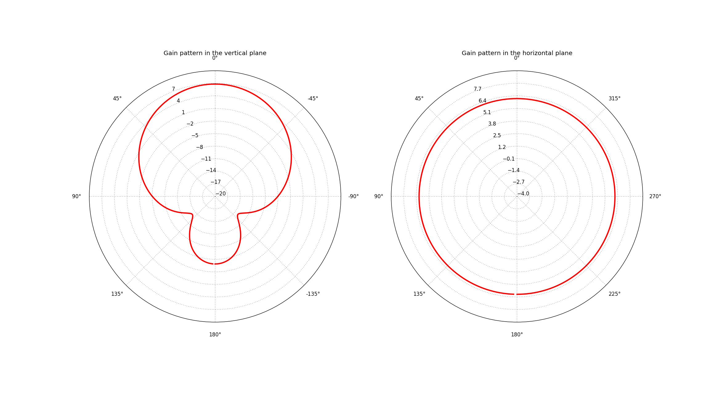

# NEC based antenna models
Models of Bolidozor antennas in NEC format.

Depends on NEC2++ python wrapper. It can be downloaded from: https://github.com/kaklik/python-necpp

## QFH Antenna OpenSCAD models

## Simulation outputs

